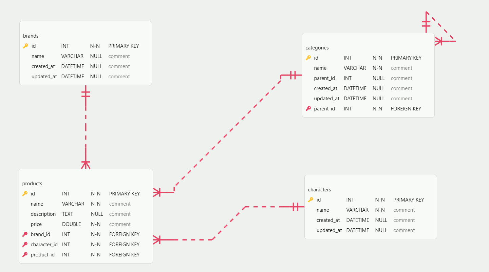

# Amazon Product Catalog ERD

This project defines the database schema for a product catalog based on the provided wireframe, which allows browsing products by **Brand**, **Category**, and **Character**.

## Database Schema Details

### 1. `brands` Table

Stores the manufacturers or brands of the products

- `id`: Primary Key
- `name`

### 2. `categories` Table

Stores product categories and supports a hierarchical structure (parent/child)

- `id`: Primary Key
- `name`
- `parent_id`: Reference to a parent category

### 3. `characters` Table

Stores characters that products might be associated with

- `id`: Primary Key
- `name`

### 4. `products` Table

The central table containing product information and linking to the other dimensions

- `id`: Primary Key
- `name`
- `description`
- `price`
- `brand_id`: Foreign Key linking to the `brands` table
- `category_id`: Foreign Key linking to the `categories` table
- `character_id`: Foreign Key linking to the `characters` table

## Relationships

### 1. Products → Brands (Many-to-One)

- **Relationship Type**: Many-to-One
- **Foreign Key**: `products.brand_id` → `brands.id`
- **Description**: Each product belongs to exactly one brand, but each brand can have multiple products

### 2. Products → Categories (Many-to-One)

- **Relationship Type**: Many-to-One
- **Foreign Key**: `products.category_id` → `categories.id`
- **Description**: Each product belongs to exactly one category, but each category can have multiple products

### 3. Products → Characters (Many-to-One)

- **Relationship Type**: Many-to-One
- **Foreign Key**: `products.character_id` → `characters.id`
- **Description**: Each product can be associated with one character, but each character can be associated with multiple products (including null values for products without an associated character)

### 4. Categories → Categories (Self-Referencing)

- **Relationship Type**: One-to-Many (Self-referencing)
- **Foreign Key**: `categories.parent_id` → `categories.id`
- **Description**: Categories can have parent-child relationships to support hierarchical organization, allowing for nested category structures

