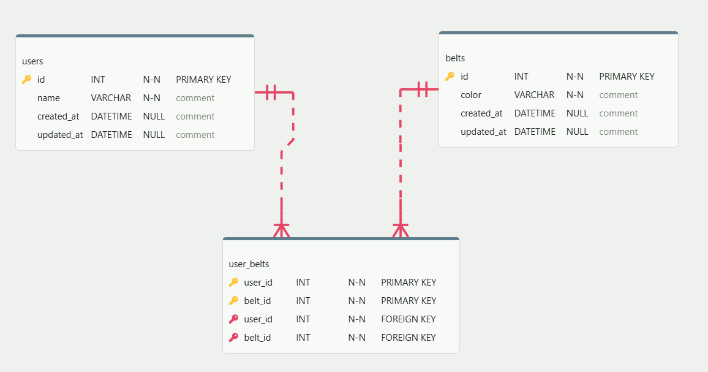

# Belts Database

This project defines a database schema to manage users and their earned belts.

## Schema Details

### 1. `users` Table

Stores information about the individuals

- `id`: auto-incrementing primary key
- `name`
- `created_at` / `updated_at`

### 2. `belts` Table

Stores the different belts

- `id`: auto-incrementing primary key
- `color`
- `created_at` / `updated_at`

### 3. `user_belts` (Join Table)

Facilitates the many-to-many relationship between users and belts

- `user_id`: Foreign key referencing `users(id)`
- `belt_id`: Foreign key referencing `belts(id)`

## Relationships

The database uses the following relationships:

- **Many-to-Many**: Users and Belts are connected through the `user_belts` join table.
  - A user can have multiple belts
  - A belt can be earned by multiple users

Foreign key constraints ensure referential integrity:

- `user_belts.user_id` → `users.id`
- `user_belts.belt_id` → `belts.id`

