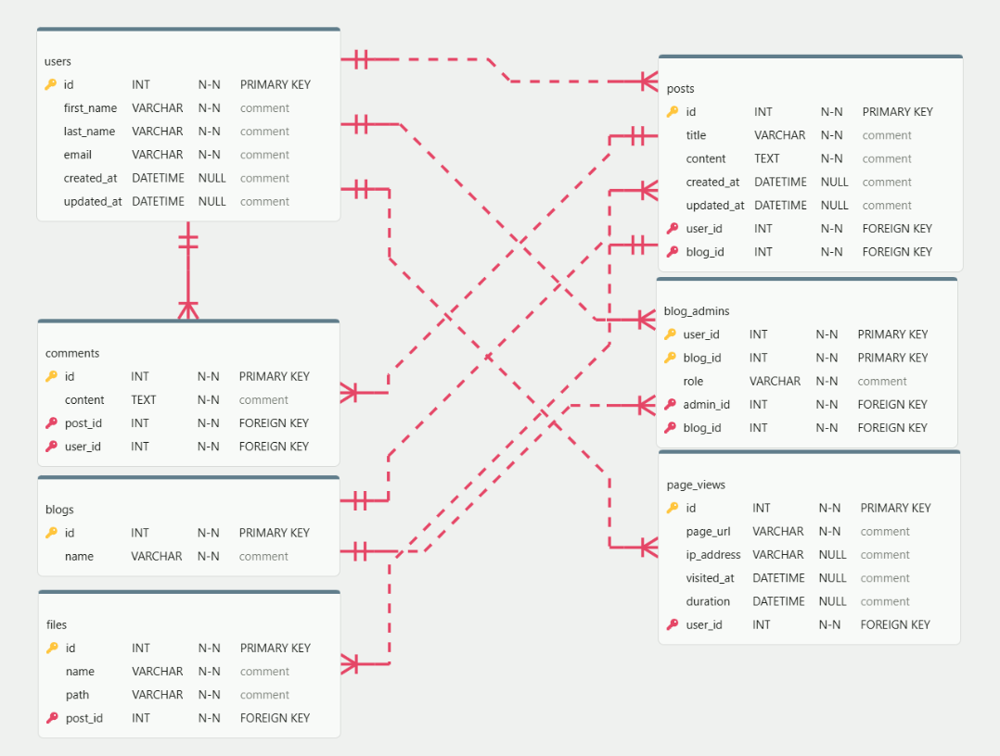

# Blogs ERD

This project contains the database design for a blog platform similar to Blogspot. The platform allows users to register, create multiple blogs, invite co-administrators, manage posts, comments, and files, and track user activity.

## Table Specifications

### 1. `users`

Stores user registration information

- `id`: Primary Key
- `first_name`, `last_name`
- `email`
- `password`

### 2. `blogs`

Stores information about blogs created on the platform

- `id`: Primary Key
- `name`

### 3. `blog_admins`

A join table facilitating the many-to-many relationship between users and blogs

- `id`: Primary Key
- `user_id`: Foreign Key referencing `users(id)`
- `blog_id`: Foreign Key referencing `blogs(id)`
- `role`

### 4. `posts`

Stores blog posts

- `id`: Primary Key
- `blog_id`: Foreign Key referencing `blogs(id)`
- `creator_id`: Foreign Key referencing `users(id)`
- `title`, `content`

### 5. `comments`

Stores comments on blog posts

- `id`: Primary Key
- `post_id`: Foreign Key referencing `posts(id)`
- `user_id`: Foreign Key referencing `users(id)`
- `content`

### 6. `files`

Stores files associated with blog posts

- `id`: Primary Key
- `post_id`: Foreign Key referencing `posts(id)`
- `file_name`, `file_path`

### 7. `page_views`

Stores user activity

- `id`: Primary Key
- `user_id`: Foreign Key referencing `users(id)`
- `page_url`
- `ip_address`
- `visited_at`
- `duration`

## Relationships

- **users** and **blogs** (Many-to-Many via `blog_admins`): A user can be an administrator for multiple blogs, and a blog can have multiple administrators
- **blogs** and **posts** (One-to-Many): Each blog can have many posts, but each post belongs to a single blog
- **users** and **posts** (One-to-Many): A user can author multiple posts and the post is for a single user
- **posts** and **comments** (One-to-Many): Each post can have multiple comments, but each comment belongs to a single post
- **users** and **comments** (One-to-Many): A user can leave many comments
- **posts** and **files** (One-to-Many): Each post can have multiple file uploads, but each file belongs to a single post
- **users** and **page_views** (One-to-Many): A user's activity on the platform generates multiple page view records

