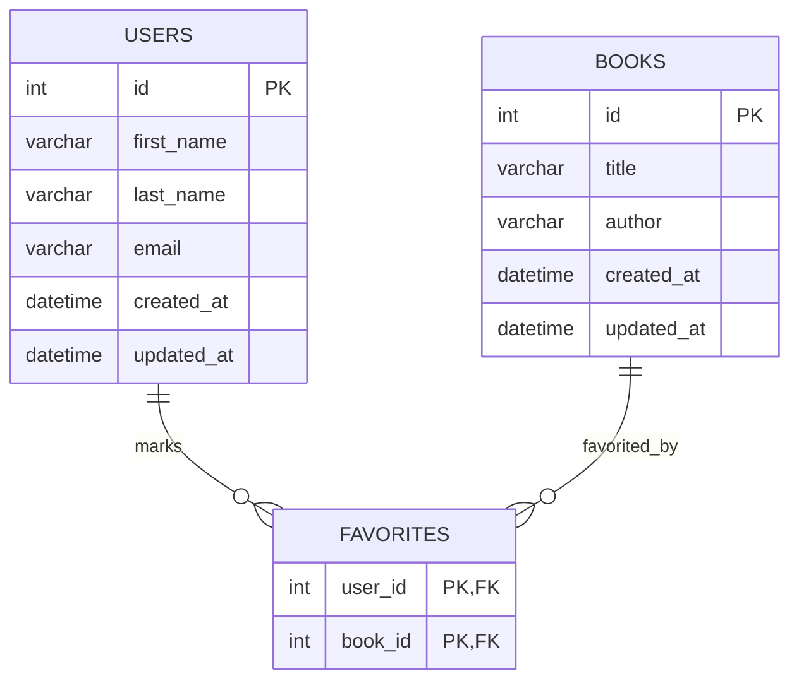

# Books & Favorites Database Schema

This project defines a MySQL database structure for tracking users, books, and the "favorite" relationships between them.

## Entity Relationship Diagram (ERD)

### Mermaid Representation

## Tables and Relationships

### 1. `users`

Stores information about the application users

- `id`: Primary key
- `first_name` & `last_name`
- `email`.
- `created_at`/`updated_at`

### 2. `books`

Stores the library of books available in the system

- `id`: Primary key
- `title`
- `author`: The name of the author (denormalized directly into the table as per requirements)
- `created_at`/`updated_at`

### 3. `favorites` (Join Table)

Handles the **Many-to-Many** relationship between `users` and `books`

- A user can have many favorite books
- A book can be favorited by many users
- `user_id`: Foreign key referencing `users(id)`
- `book_id`: Foreign key referencing `books(id)`
