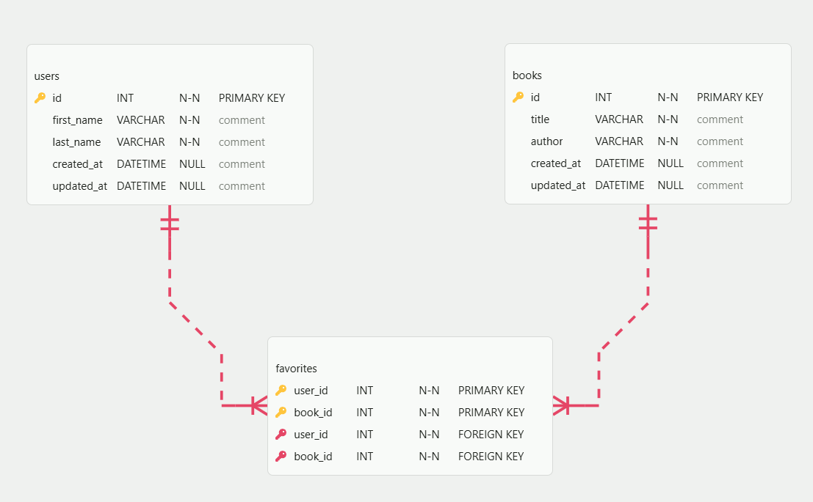

# Books & Favorites Database Schema

This project defines a MySQL database structure for tracking users, books, and the "favorite" relationships between them.

## Tables and Relationships

### 1. `users`

Stores information about the application users

- `id`: Primary key
- `first_name` & `last_name`
- `email`
- `created_at`/`updated_at`

### 2. `books`

Stores the library of books available in the system

- `id`: Primary key
- `title`
- `author`: The name of the author (denormalized directly into the table as per requirements)
- `created_at`/`updated_at`

### 3. `favorites` (Join Table)

Handles the **Many-to-Many** relationship between `users` and `books`

- A user can have many favorite books
- A book can be favorited by many users
- `user_id`: Foreign key referencing `users(id)`
- `book_id`: Foreign key referencing `books(id)`

## Relationships

### Foreign Keys

| Table       | Column    | References  | Type        |
| ----------- | --------- | ----------- | ----------- |
| `favorites` | `user_id` | `users(id)` | One-to-Many |
| `favorites` | `book_id` | `books(id)` | One-to-Many |

### Relationship Diagram

```
users (1) ──────────< (Many) favorites (Many) ──────────> (1) books
                           |
                    - user_id (FK)
                    - book_id (FK)
```

### Relationship Descriptions

1. **users → favorites** (One-to-Many)
   - One user can have many favorite books
   - Each record in `favorites` references exactly one user via `user_id`

2. **books → favorites** (One-to-Many)
   - One book can be favorited by many users
   - Each record in `favorites` references exactly one book via `book_id`

3. **users ↔ books** (Many-to-Many through `favorites`)
   - The `favorites` table acts as a join table connecting users and books
   - Allows for flexible tracking of user preferences


