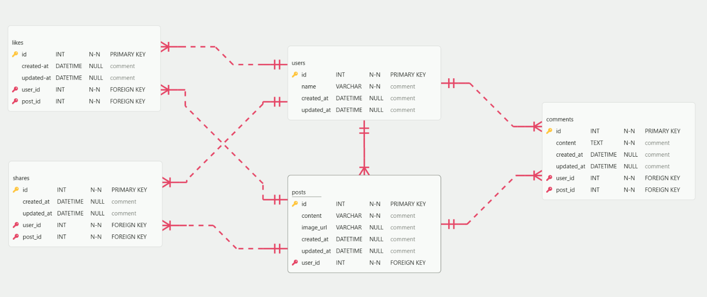

# Likes ERD

This document outlines the database structure based on the provided social media post wireframe.

## Table Details

### 1. `users`

Stores information about accounts that can post and interact

- `id`: Primary Key, Auto-increment
- `name`
- `avatar_url`
- `created_at` & `updated_at`

### 2. `posts`

Stores the main posts created by users

- `id`: Primary Key, Auto-increment
- `content`
- `image_url`
- `user_id`: Foreign Key linking to the author
- `created_at` & `updated_at`

### 3. `comments`

Stores user comments on specific posts

- `id`: Primary Key, Auto-increment
- `content`
- `user_id`: Foreign Key linking to the commenter
- `post_id`: Foreign Key linking to the parent post
- `created_at` & `updated_at`

### 4. `likes`

Tracks the many-to-many relationship of users liking posts

- `id`: Primary Key, Auto-increment
- `user_id`: Foreign Key linking to the user who liked the post
- `post_id`: Foreign Key linking to the liked post
- `created_at` & `updated_at`

### 5. `shares`

Tracks users who share specific posts

- `id`: Primary Key, Auto-increment
- `user_id`: Foreign Key linking to the user who shared the post
- `post_id`: Foreign Key linking to the shared post
- `created_at` & `updated_at`

## Relationships

### One-to-Many Relationships

1. **users → posts**: One user can create many posts and the post belongs to a single user
   - `posts.user_id` → `users.id`

2. **users → comments**: One user can create many comments and the comment belongs to a single user
   - `comments.user_id` → `users.id`

3. **users → likes**: One user can like many posts and the like belongs to a single user
   - `likes.user_id` → `users.id`

4. **users → shares**: One user can share many posts and the share belongs to a single user
   - `shares.user_id` → `users.id`

5. **posts → comments**: One post can have many comments and the comment belongs to a single post
   - `comments.post_id` → `posts.id`

6. **posts → likes**: One post can be liked by many users and the like belongs to a single post
   - `likes.post_id` → `posts.id`

7. **posts → shares**: One post can be shared by many users and the share belongs to a single post
   - `shares.post_id` → `posts.id`

### Many-to-Many Relationships

1. **users ↔ posts (via likes)**: Many users can like many posts
   - Implemented through the `likes` join table

2. **users ↔ posts (via shares)**: Many users can share many posts
   - Implemented through the `shares` join table

   
