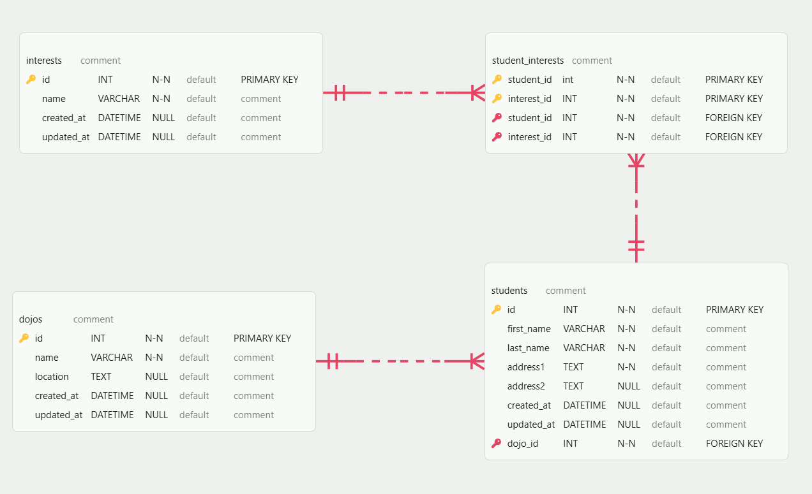

# Normalized Student & Dojo ERD

This project demonstrates the normalization of a database schema from a non-normalized state to **3rd Normal Form (3NF)**.

## The Original Issues

The previous model violated normalization in several ways:

1.  **1NF Violation**: The `interests` field was a multi-valued attribute (one cell containing many items)
2.  **1NF Violation**: The `name` fields were not atomic
3.  **Redundancy**: Tracking interests within the student table made it impossible to query data based on shared interests efficiently

## Normalization Steps Taken

### 1st Normal Form (1NF)

- **Atomicity**: Split the `name` column in the `students` table into `first_name` and `last_name`
- **Unique Primary Keys**: Ensured every table has a unique `id`
- **Eliminated Multi-valued Attributes**: Removed the `interests` text field from the `students` table

### 2nd Normal Form (2NF)

- **No Partial Dependencies**: Since all tables use a single-column primary key (`id`), all non-key attributes are fully functionally dependent on the primary key

### 3rd Normal Form (3NF)

- **No Transitive Dependencies**: By moving `interests` to its own table, we ensure that interest names depend only on the `interest_id`, not on a `student_id`
- **Many-to-Many Relationship**: Created the `student_interests` join table to link students and interests without creating redundant data

