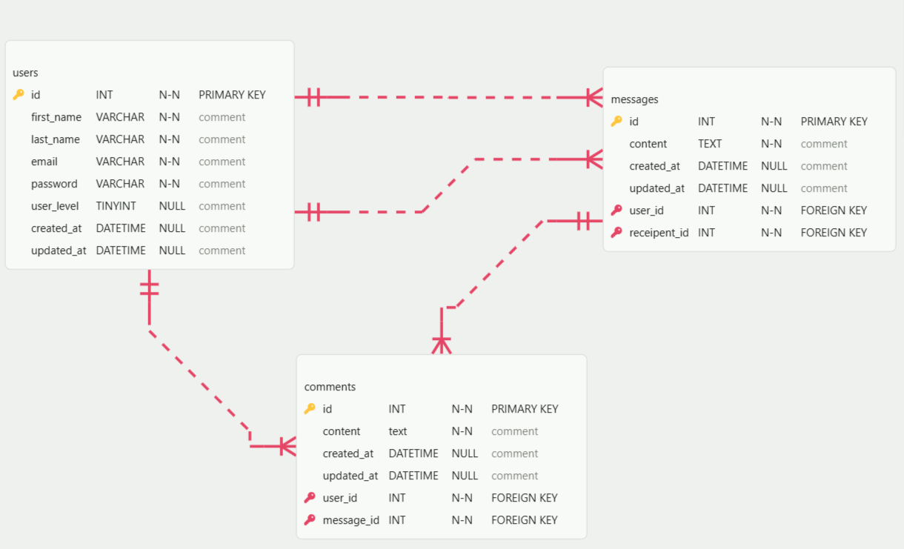

# User Dashboard ERD

This document outlines the database schema for the User Dashboard application, based on the provided wireframes.

## Tables and Relationships

### 1. `users` Table

Stores information for all registered users, including admins and normal users

- **id**: Primary Key
- **first_name / last_name**
- **email**
- **password**
- **description**
- **user_level**: Determines permissions (Admin vs. Normal)
- **Timestamps**: `created_at` and `updated_at`

### 2. `messages` Table

- **id**: Primary Key
- **user_id**: Sender ID
- **recipient_id**: Receiver ID
- **content**
- **Timestamps**: `created_at` and `updated_at`

### 3. `comments` Table

- **id**: Primary Key
- **user_id**: Author ID
- **message_id**: Message ID
- **content**
- **Timestamps**: `created_at` and `updated_at`

---

## Relationship Summary

- **User to Sent Messages**: 1 to Many
- **User to Received Messages**: 1 to Many
- **User to Comments**: 1 to Many
- **Message to Comments**: 1 to Many

