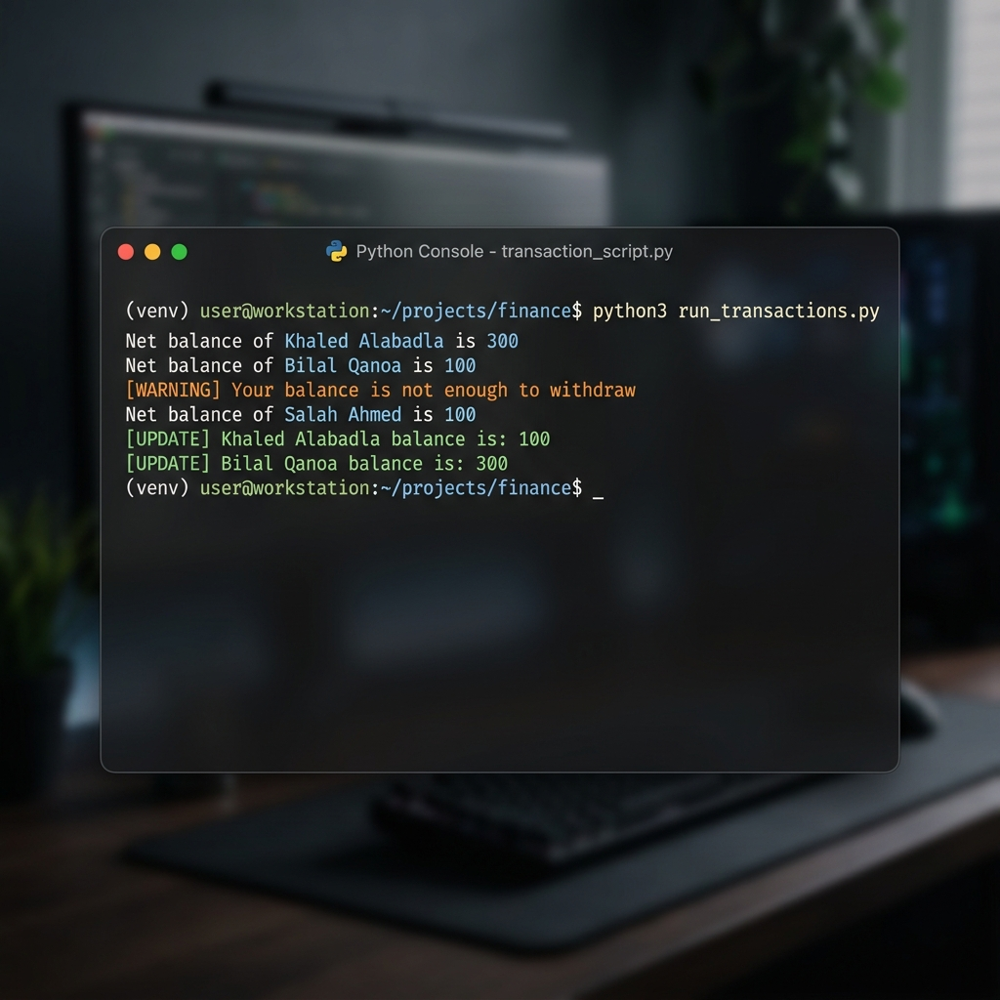

# User Assignment

A fundamental Python assignment exploring class attributes, methods, and basic financial transactions between objects.

## Features
- **Account Management**: Deposit and withdraw funds with balance checks.
- **Money Transfers**: Securely transfer funds between different `User` instances.
- **Transaction History**: Console output tracking final balances.

## Output Screenshot


## How to Run
1. Ensure Python is installed.
2. Run the script:
   ```bash
   python user.py
   ```
